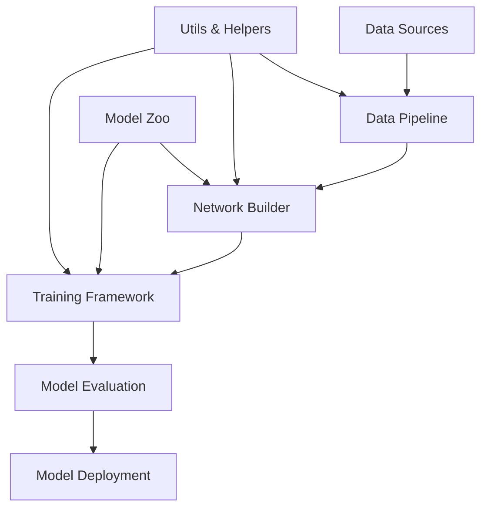

# NeuralNetworkApp Architecture

This document provides an overview of the NeuralNetworkApp architecture, its components, and how they interact.

## Core Components

### 1. Network Builder
- Fluent interface for model construction
- Supports various layer types (Dense, Conv2D, LSTM, etc.)
- Handles layer connectivity and shape inference
- Automatic model compilation

### 2. Data Pipeline
- Data loading and preprocessing
- Data augmentation
- Batch generation
- Distributed data loading support

### 3. Training Framework
- Custom training loops
- Callback system
- Distributed training support
- Mixed precision training

### 4. Model Zoo
- Predefined architectures
- Pretrained models
- Model export/import

## High-Level Architecture



## Data Flow

1. **Input Phase**
   - Raw data loading
   - Preprocessing
   - Augmentation
   - Batching

2. **Training Phase**
   - Forward pass
   - Loss computation
   - Backward pass
   - Parameter updates
   - Metric computation

3. **Evaluation Phase**
   - Model inference
   - Metric computation
   - Visualization

## Key Design Patterns

### 1. Builder Pattern
Used in `NetworkBuilder` for constructing complex model architectures in a readable way.

### 2. Strategy Pattern
For different optimization algorithms and training strategies.

### 3. Observer Pattern
Implemented in the callback system for training monitoring.

## Performance Considerations

### 1. Memory Efficiency
- Lazy loading of large datasets
- Memory mapping for large files
- Efficient data augmentation

### 2. Computational Efficiency
- GPU acceleration
- Mixed precision training
- Optimized data pipelines

### 3. Scalability
- Distributed training support
- Multi-GPU training
- Cloud integration

## Extension Points

### 1. Custom Layers
```python
class CustomLayer(tf.keras.layers.Layer):
    def __init__(self, units=32):
        super().__init__()
        self.units = units

    def build(self, input_shape):
        self.w = self.add_weight(
            shape=(input_shape[-1], self.units),
            initializer="random_normal",
            trainable=True,
        )
        self.b = self.add_weight(
            shape=(self.units,), initializer="zeros", trainable=True
        )

    def call(self, inputs):
        return tf.matmul(inputs, self.w) + self.b
```

### 2. Custom Callbacks
```python
class CustomCallback(tf.keras.callbacks.Callback):
    def on_epoch_begin(self, epoch, logs=None):
        print(f"Starting epoch {epoch}")
    
    def on_epoch_end(self, epoch, logs=None):
        print(f"Finished epoch {epoch}")
```

## Best Practices

1. **Model Design**
   - Start with a simple architecture
   - Gradually increase complexity
   - Use appropriate initialization

2. **Training**
   - Use learning rate scheduling
   - Implement early stopping
   - Monitor training with TensorBoard

3. **Evaluation**
   - Use appropriate metrics
   - Validate on a separate test set
   - Perform error analysis

## Future Roadmap

- [ ] Support for more layer types
- [ ] Advanced optimization techniques
- [ ] Enhanced visualization tools
- [ ] Model interpretability features

---
© Copyright 2025 Nsfr750. All Rights Reserved.
